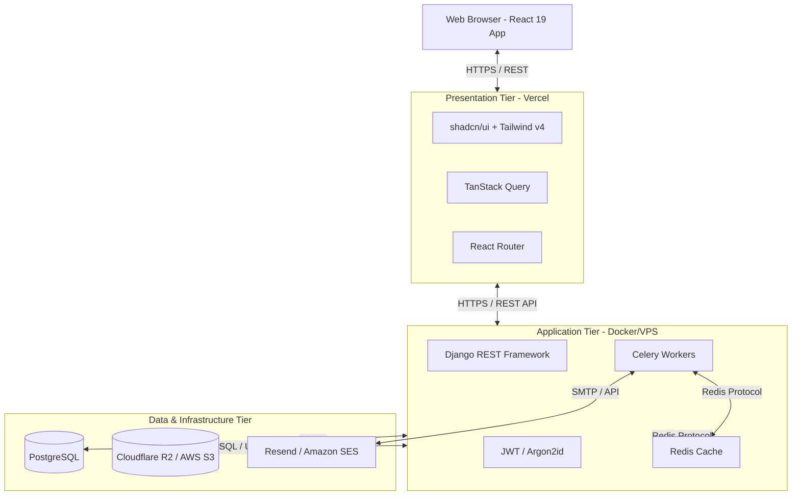

# System & Security Architecture

## 1. High-Level Architecture
The platform is built using a modern **Three-Tier Architecture** consisting of a Presentation Layer (Frontend), an Application Layer (Backend API), and a Data Layer (Database & Storage).

### Architecture Diagram (Mermaid)

## 2. Authentication & Authorization Architecture
- **Tokens**: The application uses JSON Web Tokens (JWT) for stateless authentication.
- **Token Storage**: Access tokens are stored in memory on the client. Refresh tokens are stored in `HttpOnly`, `Secure`, `SameSite=Strict` cookies to prevent XSS exfiltration and CSRF attacks.
- **Token Rotation**: Refresh tokens are rotated on use to detect and prevent token theft.
- **RBAC Enforcement**: The backend utilizes custom permission classes to enforce Object-Level Authorization. A user can only access an entity (e.g., a Request) if their Role permits it and they own the entity (unless they are Super Admin).
- **OTP Layer**: Agencies and Admins undergo a mandatory Time-based One-Time Password (TOTP) or Email OTP check during the login sequence.

## 3. File Upload & Document Security
- **Upload Flow**: 
  1. Client requests a pre-signed URL from the Django backend.
  2. Backend validates the request (size, MIME type expectations) and generates a pre-signed upload URL.
  3. Client uploads directly to the Object Storage (S3/R2).
  4. Client notifies the backend of successful upload, passing the object key.
- **Storage Strategy**: Files are stored in private buckets. They are never exposed publicly. When a user wishes to view a document, the backend generates a short-lived read-only pre-signed URL.
- **Validation**: Strict validation of `magic numbers` to ensure an uploaded `.pdf` is actually a PDF and not an executable.

## 4. DevOps & Deployment Strategy
- **Containerization**: The backend services (Django, Celery, Redis) are orchestrated using `docker-compose`.
- **CI/CD**: GitHub Actions pipeline automates testing (`pytest`, `vitest`), linting, and deployment.
- **Environments**: Strict separation of Development, Staging, and Production environments.
- **Monitoring**: Sentry is integrated into both React and Django to capture runtime exceptions. The backend utilizes structured JSON logging for log aggregation.
- **Database Backups**: Automated daily full backups and continuous WAL (Write-Ahead Logging) archiving to S3 for Point-in-Time Recovery (PITR).
